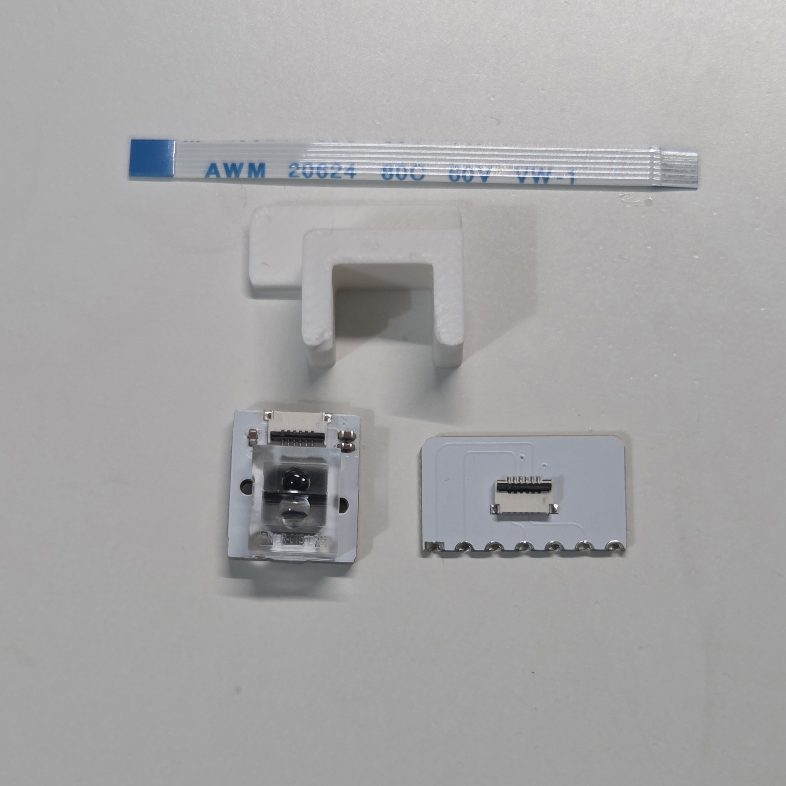
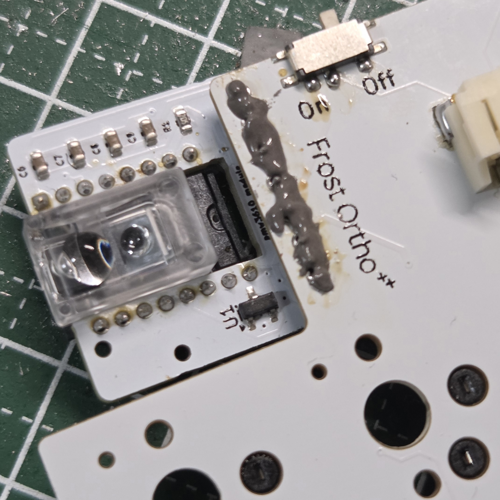
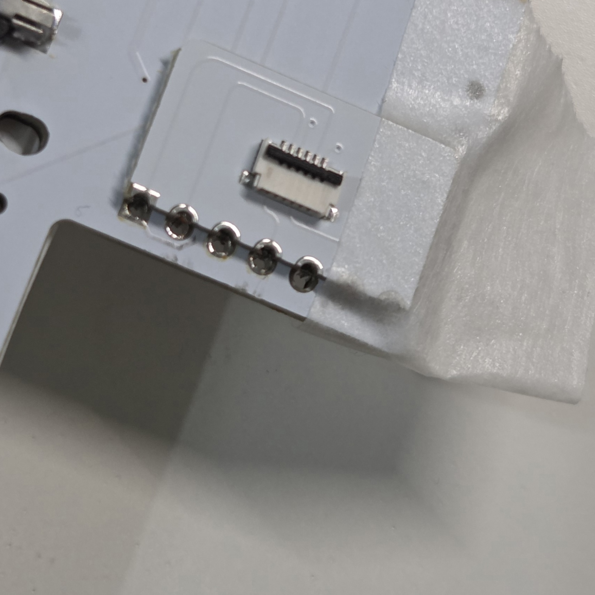
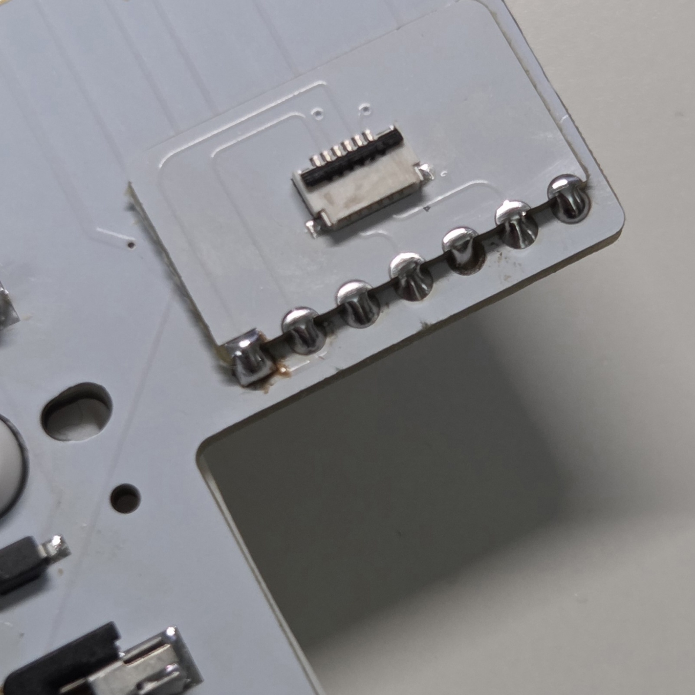
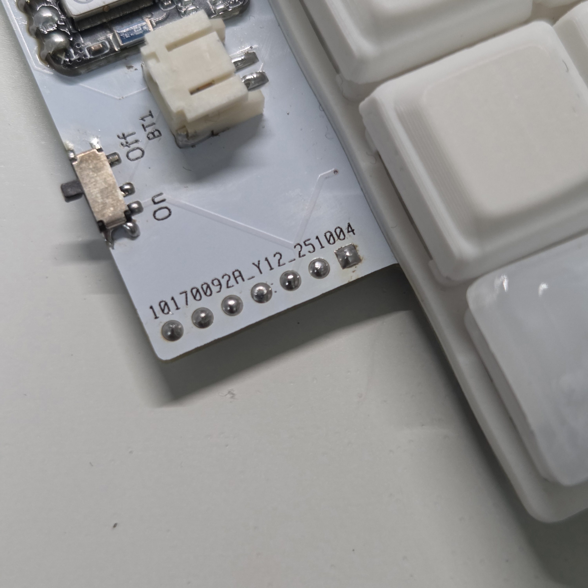
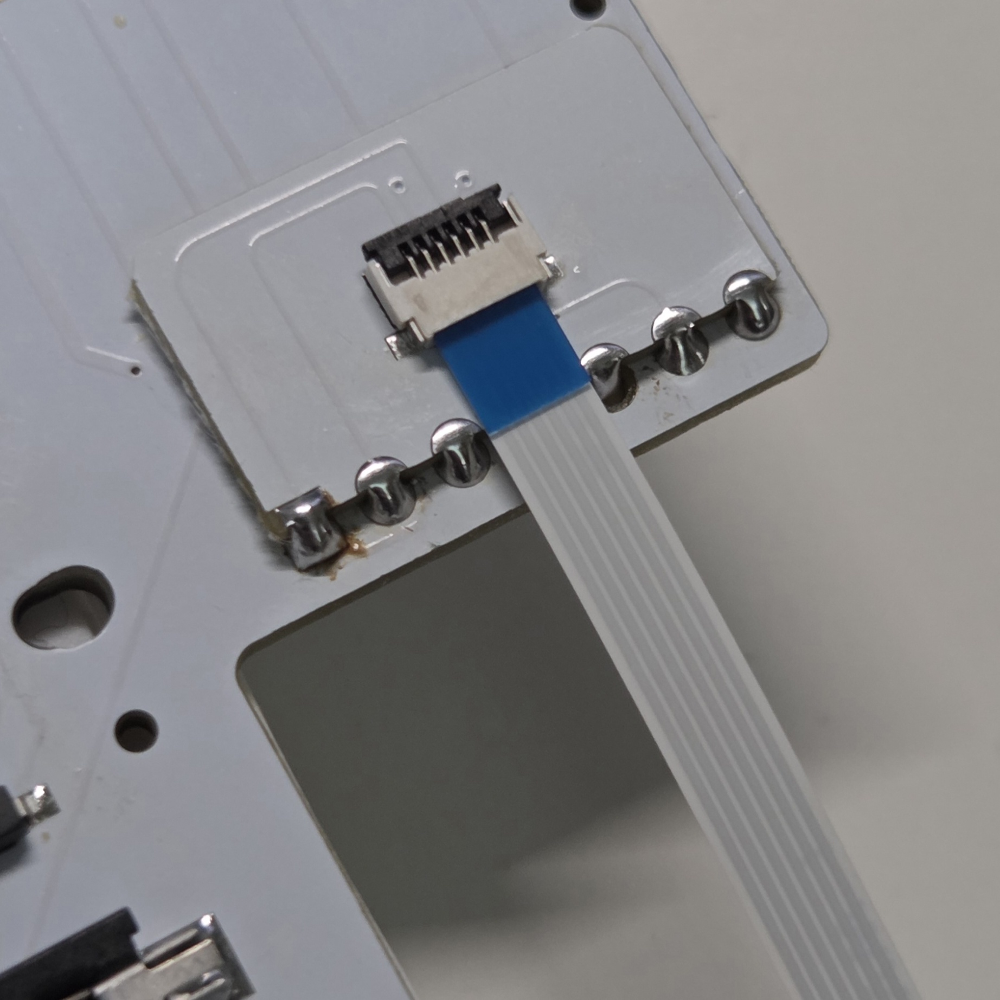
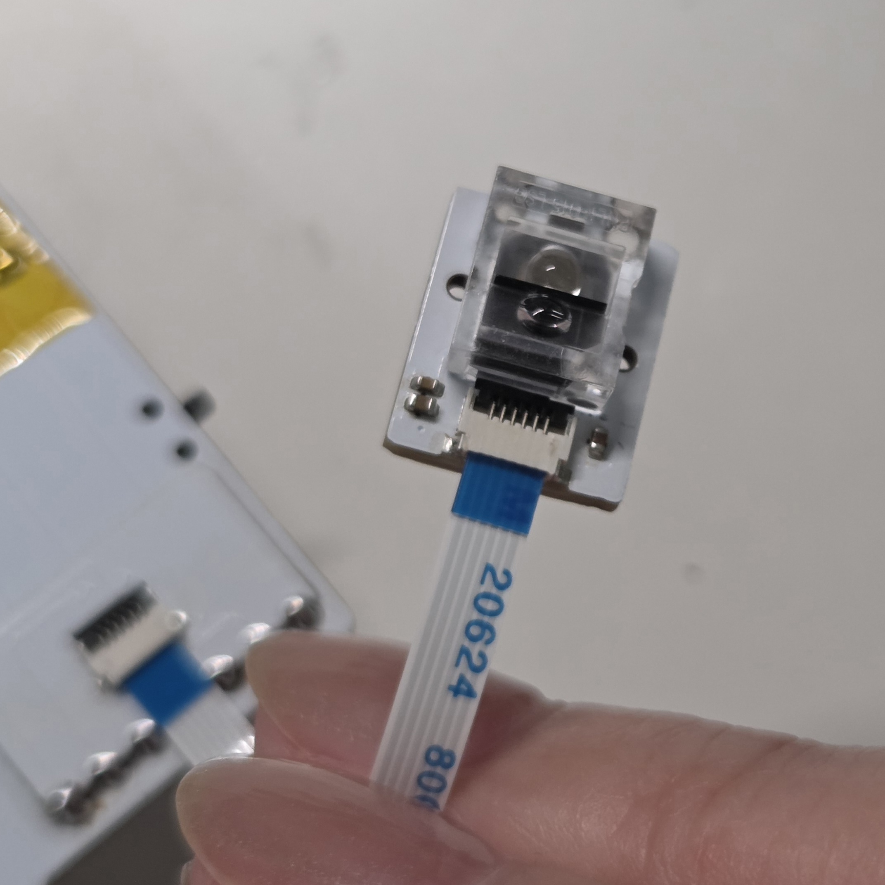
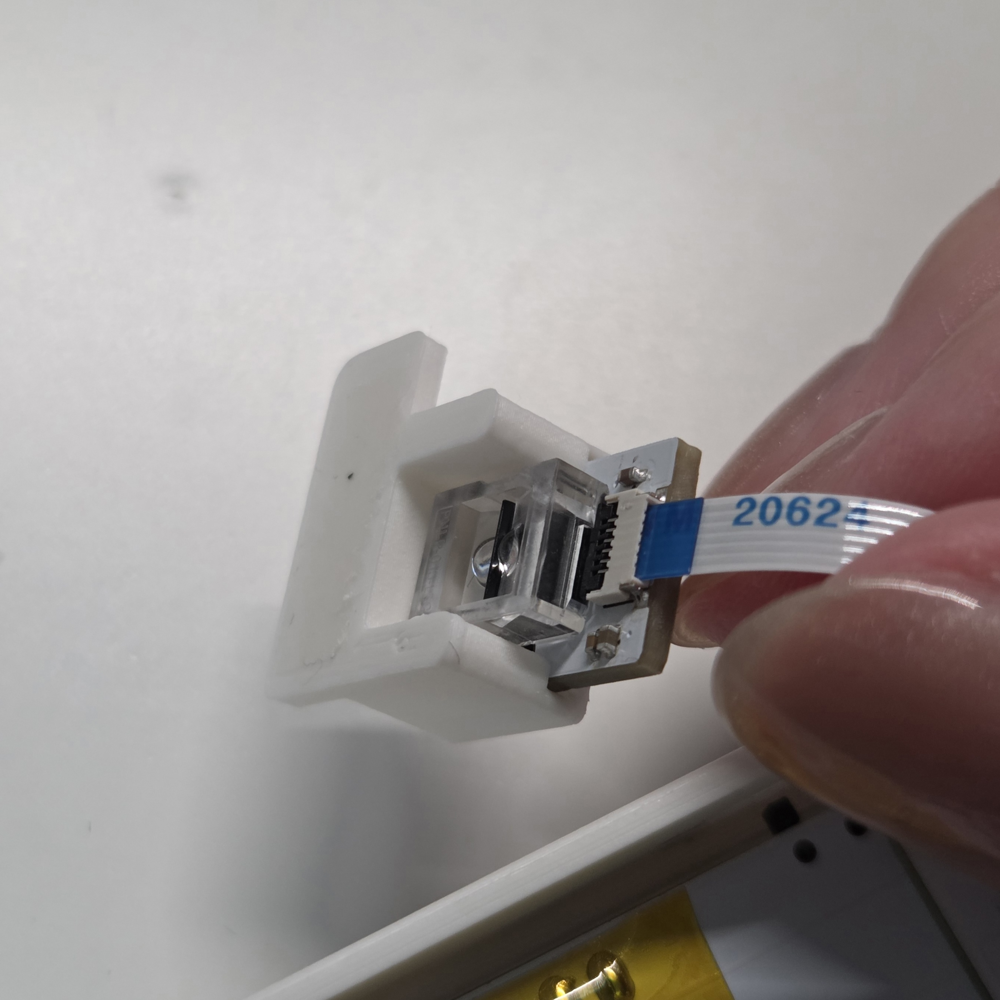

# センサーモジュール付け替えガイド

## 内容物
| 部品番号 | 部品名 | 数 | 説明 | 備考 |
| ---- | ---- | ---- | ---- | ---- |
| 1 | リボンケーブル | 1 | センサーモジュールとメイン基板を接続する |  |
| 2 | センサーモジュール | 1 | 基板 + PAW3222LU-TJDU + PNSR-015-RB3 |  |
| 3 | センサーモジュール固定パーツ | 1 | センサーモジュールをケースに固定するパーツ |  |
| 4 | ffcコネクタ変換基板 | 1 | ffcコネクタ付きの変換基板 |  |

#### 別途用意が必要
- FrostOrtho右手側基板
- 両面テープ
- はんだごて
- はんだペースト

## 組み立て
### 内容物確認
  

### はんだ付け
1. メイン基板（右）からコンスルーを取り外す  
   はんだペーストを使用する方法が個人的には一番簡単だったのでその方法を記載していますが、ランド剥がれずコンスルーが外せられれば方法は何でもいいです！  
   1. 画像のようにコンスルー付近にはんだペーストを乗せます。  
     
   2. コンスルー全体を温めるようにはんだごてを往復させながら温めます。  
   3. はんだごてを当てつつセンサー基板を下に軽く押すとぽろっと外れます。  
   4. 結構基板が汚くなるので、気になる方はフラックスリムーバーで綺麗にしてください。  
2. メイン基板（右）にffcコネクタ変換基板を取り付ける  
   1. 裏面のスルーホールとぴったり合うように置き、マスキングテープで仮止めします。  
      
   2. スルーホール裏側まではんだが流れるようにはんだ付けします。  
      
      
3.  センサーモジュールをメイン基板（右）に取り付ける  
    黒色のレバーを上げ、リボンケーブルを画像の向きで差し込み、レバーを下ろして固定します。  
      
      
    センサーモジュールについているコネクタはレバー上げづらいので、ピンセット等細いものを使用してください。  

### ケースへの取り付け
1. センサーモジュールを固定パーツに画像のように差し込み、角に合わせて固定パーツを両面テープで貼り付けます。  
      
      

### ファームウェア書き換え
1. 新しいセンサーモジュールに対応した[初期ファームウェア](./firmware)をダウンロードする  
2. 左手側キーボードとPCをケーブルで接続し、リセットスティックを2回押す  
3. XIAO-SENSE(D:)のウィンドウが表示されるため、以下ファイルをドラッグ&ドロップして書き込む  
    - FrostOrtho_L-seeeduino_xiao_ble-zmk.uf2  
4. 次は右手側キーボードとPCをケーブルで接続し、左手側と同じ手順で以下のファイルを書き込む  
    - FrostOrtho_R-seeeduino_xiao_ble-zmk.uf2  
5. 正常に書き込みできれば完了
   
#### エラー発生時
書き込み中にエラーが発生した場合は、以下リセット用ファイルを同様の手順で書き込んでください。その後、もう一度ファームウェアの書き込みを実施してください。
- settings_reset-seeeduino_xiao_ble-zmk.uf2