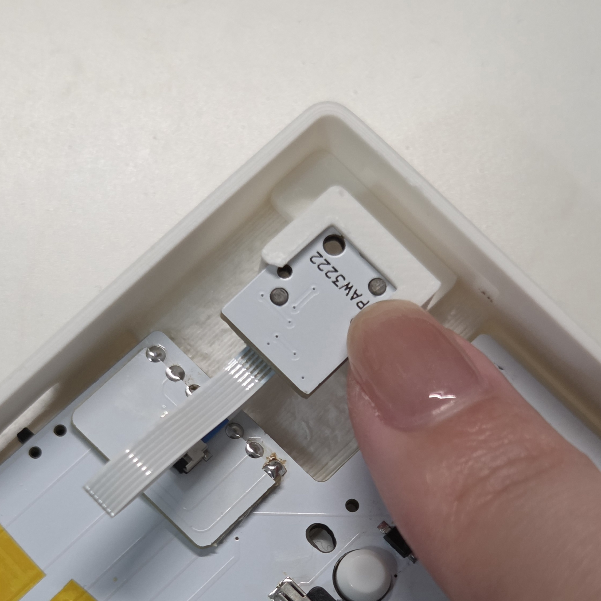

# 組立済み品ユーザーガイド

## 内容物
以下部品がすべて入っていることをご確認ください。足りないものがあればmuinoまでご連絡ください。

| 部品名 | 数 | 説明 |
| ---- | ---- | ---- |
| トップケース | 2（左右） | キーボードの外装 |
| ボトムケース | 2（左右） | キーボードの外装 |
| スイッチプレート | 2（左右） | キースイッチを固定するプレート |
| GRIPLUS（底面すべり止め） | 4 | 購入時は透明のシートが貼ってあるため剥がしてご使用ください。 |
| スイッチカバー | 2 | オンオフがわかるスイッチカバー |
| キーキャップトレイ | 1 | キーキャップ梱包用トレイ |
| キーキャップ(ノーマル) | 34～ | 指の形に沿うような形のキーキャップ。予備も入っています。 |
| キーキャップ(ホーミング) | 2 | F,Jキーに使用するホーミング付きキーキャップ。予備なしです。 |
| キーキャップ(コンベックス) | 5～ | 親指用のキーキャップ。予備も入っています。 |
| リセットスティック | 2～ | ファームウェア書き込み時に使用するスティック。小さく無くしやすいので予備も入っています。 |
| ノブ | 1 | ロータリーエンコーダーのノブ |
| トラックボールカバー | 1 | マグネットでケース本体とつけ外し可能 |
| 19mm PTFE球 | 1 | トラックボール |
| 基板 | 2（左右） | キーボードの基板 |
| センサーモジュール | 1 | 基板 + PAW3222LU-TJDU + PNSR-015-RB3 |
| Lipoバッテリー | 2 | 充電池。取り扱いにはご注意ください。 |

## 別途購入が必要
キースイッチのみ別途ご用意ください。キースイッチがないとキーボードとしてご使用いただけません。

| 部品名 | 数 | 説明 |
| ---- | ---- | ---- |
| choc v2 キースイッチ | 41 | 3ピンのchoc v2 スイッチにのみ対応しています。4ピンのもの、choc v1には対応していません。 LofreeのキースイッチやKailh Deep Sea miniシリーズ等が使用できます。 |

## 組み立て
1. キースイッチを41個差し込む。  
2. キーキャップトレイからキーキャップを取り外し、キースイッチに差し込む。  
   - ホーミングキーキャップはJ、Fの位置  
   - コンベックスキーキャップは親指で入力する一番下の行内側  
   - ⇧以外はノーマルキーキャップ  
     
   手前から見たキーキャップ  
     
   コンベックスキーキャップは手前側が低くなっています。
     
3. 組立完了！

## 使用方法

### 電源のON/OFF
両キーボードの内側にあるスライドスイッチをスライドしてON/OFFを切り替えられます。  
まずは電源をONにします。

ON/OFFどちらになっているかを確認する方法はケースの種類により異なります。  
- ice clear  
基板にON/OFFが印字されているためこちらでご確認ください。
- ice clear以外  
電源スイッチの色のついた面が見えているときは電源がONになっています。ケースと同じ色の面が見えているときはOFFになっています。

### Bluetooth接続 
1. 緑色のキー（以降はレイヤー4キーと呼びます）を押したままlayer4のBT_SEL_0～BT_SEL_4のいずれかを押下します。  
（BT_SEL_0は私用PC、BT_SEL_1はiPad、BT_SEL_2は社用PC、、など5台まで設定でき、切り替えて使用できます。）
  
  
2. PC等の端末にてBluetooth設定画面を開くと「FrostOrtho」が表示されるためペアリングします。  
3. キー入力できることが確認できれば完了！  

同様の手順で他の端末にも設定できます。  
複数設定した後の切り替えは、レイヤー4キーを押しながらBT_SEL_0～BT_SEL_4を押すことで設定した端末に切り替えられます。

### 有線接続
ファームウェア書き込み済みなので、右手側キーボードとPCを有線接続して左手側キーボードの電源スイッチをオンにすると有線接続で使用開始できます。  

### 充電方法
充電したい側のキーボードの電源をONにし、有線接続すると充電開始されます。電源がOFFになっていると充電されません。  
Lipoバッテリーは発火の恐れがありますので、充電中は目を離さないでください。  

左右の充電状況はこちらのアプリをインストールいただくとわかりやすくておすすめです。  
https://github.com/kot149/zmk-battery-center  

## キースイッチの交換
狭ピッチなので、一般的なキースイッチプラーでキースイッチを取り外すことが困難な場合が多いです。。  
ケースから基板を取り出し、基板裏側からキースイッチを押すと取り外しやすいです。  

### ケースから基板を取り出す
ケースの固定にはネジを使用しておらず、スナップフィット機構にて固定しています。  

ロータリーエンコーダーのノブやケーブルを本体から外して、左手側はQキー辺りの位置を、右手側はPキー辺りの位置を上から押してボトムケースを外してください。  
  
  

長辺側に爪があるため、固い場合は短辺側を手で持ちながらつけ外しするとスムーズです。  

電源スイッチに負荷をかけないよう、外側に斜めにスライドするように基板を取り外してください。  
電源スイッチめちゃくちゃ折れやすいのですが、折れても使用上は問題ないのでご安心くださいmm  
  
  

！ケースを外す際にリセットスティックが落ちやすいので無くさないようご注意ください。

センサーモジュールがトップケース側に差し込まれているので抜いてください。  
ケースに戻す際は再び差し込んでから蓋をしてください。  
  
センサーモジュールを固定しているパーツは両面テープで固定しているだけなので、簡単に外れるようになっています。
