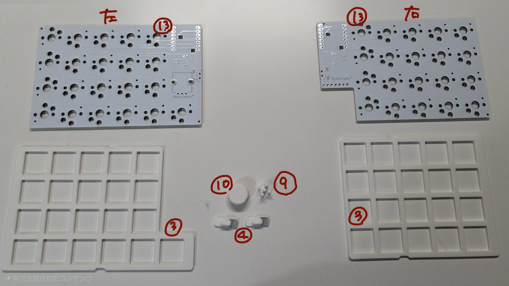

# FrostOrtho ビルドガイド

## 内容物
| 部品番号 | 部品名 | 数 | 説明 | 備考 |
| ---- | ---- | ---- | ---- | ---- |
| 1 | トップケース | 2（左右） | キーボードの外装 |  |
| 2 | ボトムケース | 2（左右） | キーボードの外装 |  |
| 3 | スイッチプレート | 2（左右） | キースイッチを固定するプレート |  |
| 4 | スイッチカバー | 2 | オンオフがわかるスイッチカバー |  |
| 5 | キーキャップトレイ | 1 | キーキャップ梱包用トレイ |  |
| 6 | キーキャップ(ノーマル) | 34～ | 指の形に沿うような形のキーキャップ。予備も入っています。 |  |
| 7 | キーキャップ(ホーミング) | 2 | F,Jキーに使用するホーミング付きキーキャップ。予備なしです。 |  |
| 8 | キーキャップ(コンベックス) | 8～ | 親指用のキーキャップ。予備も入っています。 |  |
| 9 | リセットスティック | 2～ | ファームウェア書き込み時に使用するスティック。小さく無くしやすいので予備も入っています。 |  |
| 10 | ノブ | 1 | ロータリーエンコーダーのノブ |  |
| 11 | トラックボールカバー | 1 | マグネットでケース本体とつけ外し可能 |  |
| 12 | 19mm PTFE球 | 1 | トラックボール |  |
| 13 | 基板 | 2（左右） | キーボードの基板 |  |
| 14 | トラックボール用基板 | 1 | トラックボール用基板 |  |
| 15 | 電源スイッチ | 2 | スライドスイッチ | 購入先 ⇒ https://www.aitendo.com/product/16631 |
| 16 | PHコネクタ | 2 | バッテリーを基板と接続するコネクタ。PH2.0です。 | 購入先 ⇒ https://akizukidenshi.com/catalog/g/g112810/ |
| 17 | リボンケーブル | 1 | トラックボール基板とメイン基板を接続する |  |
| 18 | PAW3222LU-TJDU + PNSR-015-RB3 | 1 | 光学センサー＋レンズ |  |
| 19 | ffcコネクタ変換基板 | 1 | ffcコネクタ付きの変換基板 |  |

#### 別途購入が必要
| 部品番号 | 部品名 | 数 | 説明 | 購入先例
| ---- | ---- | ---- | ---- | ---- |
| 20 | choc v2 キースイッチ | 41 | 3ピンのchoc v2 スイッチにのみ対応しています。4ピンのもの、choc v1には対応していません。 LofreeのキースイッチやKailh Deep Sea miniシリーズ等が使用できます。 | 遊舎工房、TALP KEYBOARD、Lofree、AliExpressなど |
| 21 | Lipoバッテリー | 2 | 充電池。取り扱いにはご注意ください。20.5×5.3×32.0mm以下のサイズであれば搭載できます。 | https://www.amazon.co.jp/dp/B08FD3V6TF?ref=ppx_yo2ov_dt_b_fed_asin_title |
| 22 | すべり止め | - | 底面に貼るすべり止め | 薄いのがよければ ⇒ https://www.amazon.co.jp/dp/B0CT8LCK52?ref=ppx_yo2ov_dt_b_fed_asin_title&th=1 |
| 23 | XIAO nRF52840 | 2 | マイコン | https://shop.talpkeyboard.com/products/seeed-studio-xiao-nrf52840-xiao-ble?_pos=1&_sid=62f5b16c9&_ss=r |
| 24 | choc用 ソケット | 41 | キーソケット | https://shop.talpkeyboard.com/products/choc-kailh-pcbsocket-10?_pos=2&_sid=53941f02a&_ss=r |
| 25 | ロープロファイルロータリーエンコーダー | 1 | 背の低いロータリーエンコーダー | https://shop.yushakobo.jp/products/2141?_pos=1&_sid=3c8fc5e4b&_ss=r&variant=37799941963937 |

## 組み立て
### 内容物確認
  
  

### はんだ付け
1. メイン基板にchoc用ソケットを取り付ける  
    1. 片方のパッドに事前にはんだを盛ります（予備はんだ）。  
    2. ソケットをシルク表示に合わせて乗せて、ピンセットで軽く押しながら予備はんだを溶かして固定します。  
    一列だけソケットの向きが反対になっているので注意してください。  
      
      
    3. 反対側のパッドもはんだを流して固定します。  
2. 右側メイン基板にffcコネクタ変換基板を取り付ける
   1. 裏面のスルーホールとぴったり合うように置き、マスキングテープで仮止めします。
   2. スルーホール裏側まではんだが流れるようにはんだ付けします。
3. XIAO nRF52840を取り付ける  
   1. 表面  
    xiaoに付属のピンを使ってxiaoを基板に仮固定します。  
    ピンを最後まで押し込まなくても、一旦固定できればOK。  
    赤丸の部分にはんだを乗せて、xiaoと基盤を仮固定します。（反対側も）
      
    ピンを抜き、全てはんだ付けします。
      
   2. 裏面  
    基板を裏返し、赤枠の部分のはんだ付けをします。
      
    ここが少し難しいのですが、画像のようにコテを当ててはんだを流し込むとやりやすいかなと思います。（わかりづら過ぎる絵ですみません）  
      
    はんだが繋がらないよう注意してください。  
    細いコテ先を使うとやりやすいかも。  
      
4. 電源スイッチを取り付ける  
    穴にはまるように乗せます。  
      
    ずれやすいのでマスキングテープで固定して、はんだ付けします。  
      
5. バッテリー用コネクタを取り付ける  
    一か所にだけ先にはんだを盛り、溶かしながら位置を調整します。  
    位置が決まれば4か所すべてはんだ付けします。 
      
     
6. ロータリーエンコーダーを取り付ける  
   1. ロータリーエンコーダーのトルクを外す（任意）  
    赤丸の爪をピンセットやラジオペンチを使って立ち上げます。  
      
    分解して、銅色のパーツを取り外して元に戻します。  
      
   2. メイン基板（左）に取り付ける  
    表側から差し込み、裏側ではんだ付けします。  
      
7.  トラックボール用基板をメイン基板（右）に取り付ける  
    リボンケーブルを画像の向きで差し込みます。  
    トラックボール用基板についているコネクタはレバー上げづらいので、ピンセット等細いものを使用してください。  

### ケースへの取り付け
1. バッテリーをつける  
    極性があるので注意してください。購入したバッテリー側の極性と基板側の極性が合わない場合、バッテリー側で配線の入れ替えが必要です。  
      
      
    基板裏側の空いているスペースにテープで固定します。  
      
2. 基板の上にスイッチプレートを乗せ、キースイッチを差し込む  
   右  
     
   左  
     
3. 電源スイッチにスイッチカバーを取り付ける  
    色がついている側が「OFF」側になるように差し込んでください。  
      
4. トップケースにリセットスティックを差し込む  
     
5. トップケースに基板をはめ込む  
    電源パーツをトップケースの穴に差し込むように、斜めに入れてください。  
      
    右側はトラックボール用基板を画像の用に差し込んでください。
    
6. ボトムケースをはめ込む
    片方の爪を引っ掛け、もう片方を押し込むようにはめ込みます。
    右  
      
    左  
      

### 使用方法
ここからは組立済み品の使用方法をご覧ください。  
- [組立済み品ユーザーガイド](./doc/組立済み品ユーザーガイド.md)
